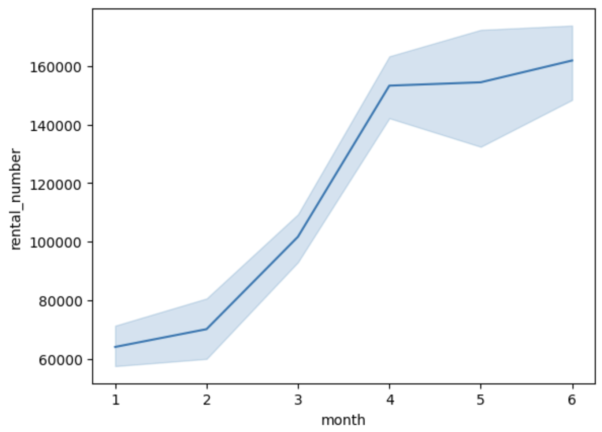

# 📊 Monthly Rental Volume of Public Bicycles in Seoul

> Analysis of monthly rental trends of public bicycles in Seoul (Jan–Jun 2024)

## 📌 Project Overview

- **Objective**: Analyze the **monthly rental trends** of public bicycles in Seoul from January to June 2024 to understand usage patterns through data visualization.
- **Data Source**: [Seoul Open Data Plaza](https://data.seoul.go.kr)

## 🛠️ Tech Stack

- **Language**: Python  
- **Libraries**: Pandas, Seaborn, Matplotlib  
- **Environment**: Jupyter Notebook / VS Code

## 🧾 Dataset Description

- **File**: `Seoul_Bike_Daily_Rentals_2024_1-6.csv`
- **Columns**:
  - `rental_date`: Date of rental (converted from Korean column `대여일자`)
  - `rental_number`: Total number of rentals on that date (`대여건수`)

## 📈 Summary of Analysis

1. Loaded the dataset and resolved encoding issues (`cp949`)
2. Renamed columns to English and converted date strings to `datetime`
3. Extracted the month from dates for aggregation
4. Visualized monthly rental trends using Seaborn line plot

## 🖼️ Visualization Result

- Significant increase in rentals during **April and May** → likely due to warmer spring weather
- **January and February** show lower usage, consistent with cold winter conditions

## 💡 Key Insights

- **Seasonal patterns** have a strong influence on bike rental behavior.
- Maintenance and supply of public bikes should be reinforced in **peak seasons (spring)**.
- **Off-season** promotions or winter rental services (e.g. gloves, blankets) could boost usage.

## 🧠 Lessons Learned

- `.crdownload` files are incomplete downloads → resolved by re-downloading
- Korean CSV files often require specific encoding like `cp949` or `utf-8-sig` for proper reading in Python

## 🔗 Notes

- This project focuses on **basic data exploration and visualization**.
- Full analysis can be found in the Jupyter Notebook (`bike_rental_analysis.ipynb`).

